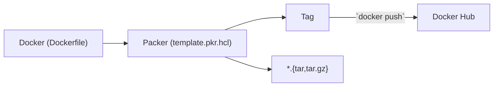

# Packer Image Factory

This repository demonstrates a [Packer](https://www.packer.io/) Image Building Pipeline using Docker as the builder. It leverages the `sysbox-runc` container runtime from [Nestybox](https://github.com/nestybox/sysbox) for running VM-like containers with Docker, providing enhanced isolation and compatibility with traditional VM workloads.



All stages of the pipeline are orchestrated locally using [Taskfile.yml](https://taskfile.dev/), a modern and simple task runner for automating tasks.

## **Stage 1:** Build from Dockerfile

In the first stage, we build a Docker image using a Dockerfile. This stage involves the following steps:

1. **Define the Dockerfile**: The Dockerfile contains all the instructions needed to build the base image. This includes installing necessary packages, setting up the environment, and copying application files.

2. **Build the Docker Image**: This process is repeatable and ensures that the image is built consistently every time.

3. **Configuration and Optimization**: During the build process, various configurations are applied to optimize the image for runtime performance.

## **Stage 2:** Build with Packer (`docker commit`)

In the second stage, we use Packer to further customize the Docker image built in the first stage. Packer allows us to create machine images in a uniform way, and helps capture the current state of a container as a new image.

1. **Define the Packer Template**: The `sample-template.pkr.hcl` file contains the Packer configuration, specifying the source image and the provisioners to run. Provisioners perform tasks like installing software and configuring the system.

2. **Run Packer Build**: Packer starts a container from the base image, applies the defined provisioners, and commits the changes to create a new Docker image.

3. **Tag and Push**: The final image is tagged and optionally pushed to Docker Hub or another Docker registry for distribution.

4. **Export the Image**: The image can also be exported as a tarball for distribution or backup purposes.


## Task Automation with Taskfile.yml

All these steps are automated using [Taskfile.yml](https://taskfile.dev/), which simplifies running complex sequences of commands.

- Run the whole Build Pipeline:
    ```bash
    task build
    ```
- Build from Dockerfile
    ```bash
    task build-dockerfile
    ```
- Build with Packer (assumes artifact exists from Dockerfile Build)
    ```bash
    task build-packer
    ```

**Note:** Building from Dockerfile or Packer assumes SSH Key Pair are generated.
```bash
task generate-ssh
```
